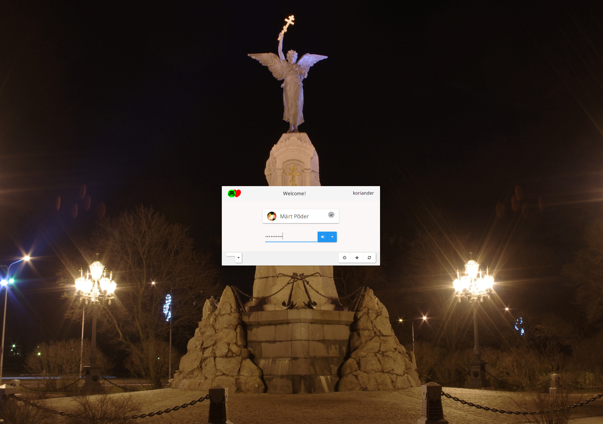

# lightdm-webkit-theme-home-taping

### Overview

This is an extra theme for [lightdm-webkit2-greeter](http://github.com/Antergos/lightdm-webkit2-greeter), which is basically just simplified Antergos theme without background switcher. If you want to use this theme in Webkit2 greeter, clone the repository and merge to use the modified [theme properties](https://github.com/boamaod/web-greeter/blob/stable/data/lightdm-webkit2-greeter.conf).

### Screenshots

### Prerequisites
* lightdm-webkit2-greeter

### Installation
This theme is a fork of `lightdm-webkit2-greeter` Antergos theme which is installed by default for Antergos users. Non-Antergos users should see [lightdm-webkit2-greeter](https://github.com/Antergos/lightdm-webkit2-greeter/) for installation details.

### User Icons Management

To change users icons:

* Create a resource named with the user's login in `/var/lib/AccountsService/icons/`
* Edit `/var/lib/AccountsService/users/<userLogin>` and add a property `Icon` targeting the icon resource you just created.

## Theme JavaScript API:
The greeter exposes a JavaScript API to themes which they must use to interact with the greeter (in order to facilitate the user login process). For more details, check out the [API Documentation](https://doclets.io/Antergos/lightdm-webkit2-greeter/master). 

## Translations
Translations are managed through [Transifex](http://transifex.com).

